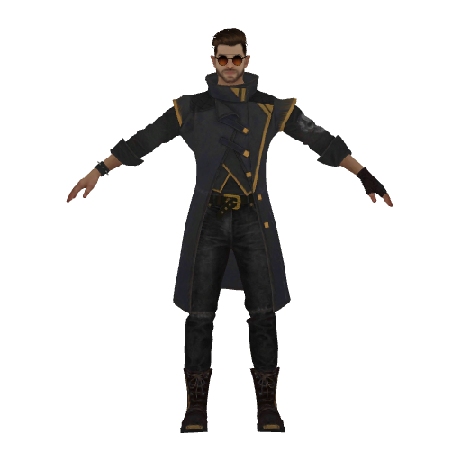
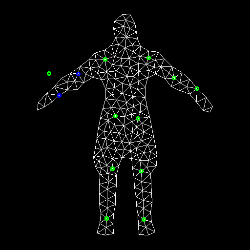
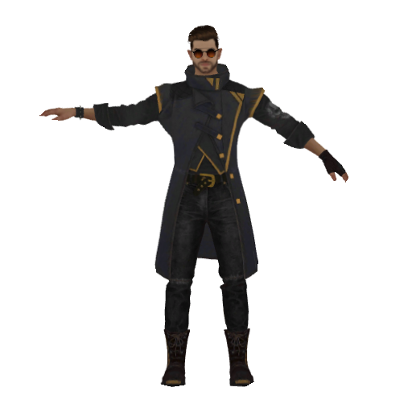

# ARAP (As-rigid-as possible) Deformation

## Features

- Construct triangular mesh from 2d Image & Mask.
- Deform the mesh following some pre-defined handle-points.
- Render the mesh using PyTorch3d.

## Entry point

```commandline
python main.py 
```

## Some results

In the `Handle points` column, Green is the target key-points, while Blue is the original key-points.

| Source image                                      | Handle points                                      | Deformed image                                      |
|---------------------------------------------------|----------------------------------------------------|-----------------------------------------------------|
|  |  |  |

Install pytorch3d (based on https://github.com/facebookresearch/pytorch3d/blob/main/INSTALL.md):

conda create -n ARAP python=3.9
conda activate ARAP
conda install -c pytorch pytorch=1.10.1 torchvision cudatoolkit=10.2
conda install -c fvcore -c iopath -c conda-forge fvcore iopath

conda install pytorch3d -c pytorch3d
conda install matplotlib

pip install --no-index --no-cache-dir pytorch3d -f https://dl.fbaipublicfiles.com/pytorch3d/packaging/wheels/py38_cu113_pyt1110/download.html